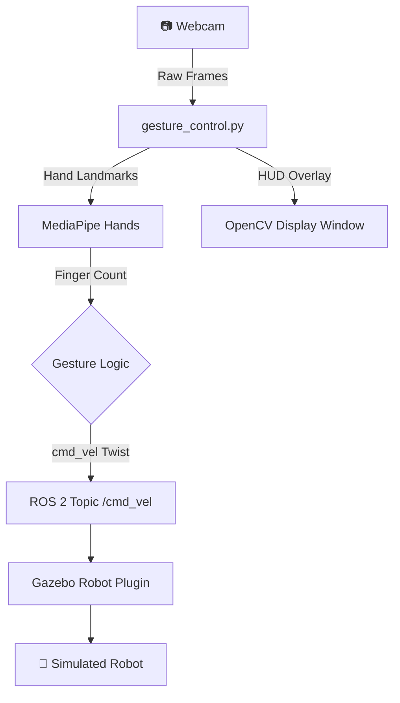

<div align="center">

```
  ____  _____ ____ _____ _   _ ____  _____    ____  ___  ____   ___ _____
 / ___|| ____/ ___|_   _| | | |  _ \| ____|  |  _ \/ _ \| __ ) / _ \_   _|
| |  _ |  _| \___ \ | | | | | | |_) |  _|    | |_) | | | |  _ \| | | || |
| |_| || |___ ___) || | | |_| |  _ <| |___   |  _ <| |_| | |_) | |_| || |
 \____|_____|____/ |_|  \___/|_| \_\_____|   |_| \_\\___/|____/ \___/ |_|
```

# 🤖 Gesture Controlled Mobile Robot

### *Control a robot in Gazebo with nothing but your hand gestures*

[](https://docs.ros.org/en/humble/)
[](http://gazebosim.org/)
[](https://www.python.org/)
[](https://mediapipe.dev/)
[](https://opencv.org/)

</div>

---

## 📋 Table of Contents

- [Overview](#-overview)
- [Features](#-features)
- [Demo](#-demo)
- [Architecture](#-architecture)
- [Gesture Controls](#-gesture-controls)
- [Requirements](#-requirements)
- [Installation](#-installation)
- [Usage](#-usage)
- [Package Structure](#-package-structure)
- [Author](#-author)

---

## 🌟 Overview

**Gesture Controlled Mobile Robot** is a ROS 2 (Humble) project that enables real-time control of a simulated 4-wheeled mobile robot in **Gazebo Classic** using **hand gestures** detected via a webcam. The system leverages **MediaPipe** for hand landmark tracking and **OpenCV** for real-time visual feedback through a professional HUD interface.

Simply raise your fingers in front of the camera — the robot responds instantly in simulation!

---

## ✨ Features

| Feature | Description |
|---|---|
| 🖐️ **Real-time Hand Tracking** | Uses MediaPipe to detect and track hand landmarks at up to 30 fps |
| 🤖 **Gazebo Simulation** | Full physics-based simulation with URDF/Xacro robot model |
| 📊 **Professional HUD** | Live telemetry sidebar with FPS, velocity bars, D-Pad, finger dots, and guide |
| ⚡ **Low Latency Control** | 50ms timer loop (20 Hz) publishing `cmd_vel` Twist messages |
| 🎨 **Smooth Velocity** | Exponential smoothing on linear and angular velocity for natural motion |
| 📡 **ROS 2 Native** | Full `rclpy` Node integration with cleanly structured launch file |

---

## 🎬 Demo

> Launch the simulation and the gesture control node, point your webcam at your hand, and control the robot!

```
┌────────────────────────────────┬──────────────────┐
│                                │  GESTURE ROBOT   │
│    Gazebo Simulation View      │  Mobile Control  │
│                                │  FPS: 29.4       │
│   [Robot moves based on        │  COMMAND: FORWARD│
│    your finger gestures!]      │  ●●●○○ FINGERS   │
│                                │  LINEAR X  ████  │
│                                │  ANGULAR Z ░░░░  │
└────────────────────────────────┴──────────────────┘
```

---

## 🏗️ Architecture



**Node Graph:**
```
[gesture_control_node] ──/cmd_vel──> [gazebo_robot_plugin]
         │
         └──> [OpenCV HUD Window]
```

---

## 🖐️ Gesture Controls

| Fingers Raised | Command | Robot Action |
|:-:|---|---|
| ☝️ **1 finger** | `FORWARD` | Move Forward at 0.5 m/s |
| ✌️ **2 fingers** | `BACKWARD` | Move Backward at 0.5 m/s |
| 🤟 **3 fingers** | `TURN LEFT` | Rotate Left at 1.0 rad/s |
| 🖐️ **4 fingers** | `TURN RIGHT` | Rotate Right at 1.0 rad/s |
| ✊ **0 fingers** | `STOP` | Robot Stops |

> **Tip:** Use your dominant hand clearly in front of the webcam for best results. Good lighting improves detection accuracy!

---

## 📦 Requirements

### System
- Ubuntu 22.04
- ROS 2 Humble Hawksbill
- Gazebo Classic (comes with ROS 2 Humble)
- Python 3.10+
- A USB Webcam

### Python Dependencies
```bash
pip install mediapipe opencv-python numpy
```

### ROS 2 Dependencies
```
rclpy
geometry_msgs
sensor_msgs
cv_bridge
gazebo_ros
robot_state_publisher
xacro
```

---

## 🚀 Installation

### 1. Clone the Repository
```bash
git clone https://github.com/dilip-2006/gesture_mobile_robot.git
cd gesture_mobile_robot
```

### 2. Install Python Dependencies
```bash
pip install mediapipe opencv-python numpy
```

### 3. Build the ROS 2 Workspace
```bash
cd ~/gesture_mobile_robot
colcon build
source install/setup.bash
```

> 💡 Add `source ~/gesture_mobile_robot/install/setup.bash` to your `~/.bashrc` to avoid sourcing every time.

---

## ▶️ Usage

### Launch the Full Simulation (Gazebo + Gesture Control)
```bash
ros2 launch mobile_robot gazebo_gesture.launch.py
```

This single command will:
1. ✅ Start **Gazebo Classic** with the robot model
2. ✅ Launch the **Robot State Publisher**
3. ✅ Spawn the robot entity in simulation
4. ✅ Start the **Gesture Control Node** with live webcam feed

### Verify the Robot is Receiving Commands
In a new terminal:
```bash
ros2 topic echo /cmd_vel
```

---


## 🛠️ Troubleshooting

| Issue | Solution |
|---|---|
| Webcam not detected | Check `/dev/video0` exists: `ls /dev/video*` |
| Low detection accuracy | Ensure good lighting and keep hand within frame |
| Robot not moving | Verify Gazebo plugin is loaded: `ros2 topic list` |
| Build fails | Run `rosdep install --from-paths src --ignore-src -r -y` |

---

## 📜 License

This project is open-source. Feel free to use, modify, and distribute for educational and research purposes.

---

## 👤 Author

<div align="center">

### **Dilip Kumar S**
*Robotics Developer*

[](mailto:letsmaildilip@gmail.com)
[](https://github.com/dilip-2006)

---

*If this project helps or inspires your robotics journey, a ⭐ on the repository would mean a lot!*

**[⭐ Star this Repository](https://github.com/dilip-2006/gesture_mobile_robot)**

</div>
